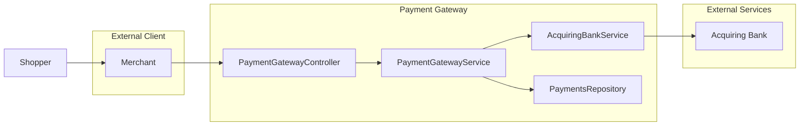
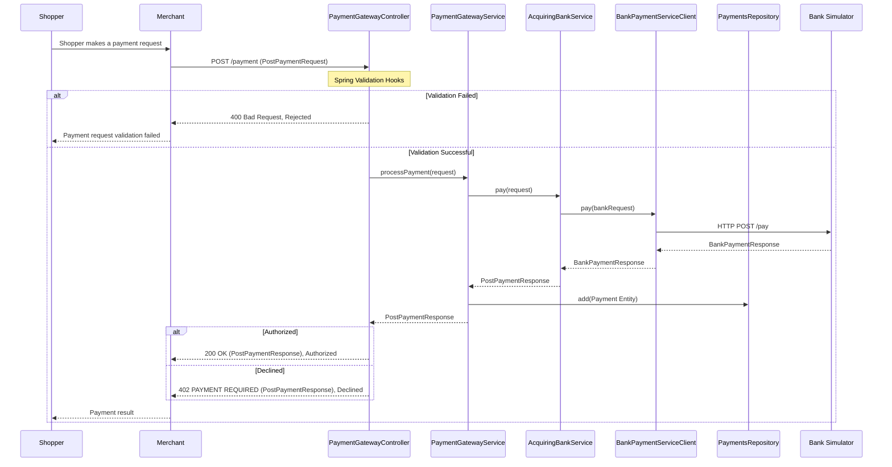

# Payment Gateway - Developer Guide

## Overview
The **Payment Gateway** is a Spring Boot application used to send and manage payment transactions between merchants and acquiring bank.
It provides REST APIs to create payments and track their status.

Directory structure of important files:
```text
src/
 └── main/java/com/checkout/
    ├── acquiring/bank/                                 # Calls bank API simulator
    │    ├── BankPaymentServiceClient.java
    │    └── RestClientConfig.java
    └── payment/gateway/
         ├── controller/                                # REST API Endpoints
         │    └── PaymentGatewayController.java
           ├── exception/                               # Error handling
           │    └── handler/GlobalExceptionHandler.java
           ├── model/                                   # DTO, Entity & Mappers
           │    ├── dto/PostPaymentRequest.java
           │    └── entity/Payment.java
           ├── repository/                              # Data Access
           │    └── PaymentsRepository.java
           ├── service/                                 # Business Logic
           │    ├── PaymentGatewayService.java
           │    └── AcquiringBankService.java
           └── validator/                               # Custom validations
                ├── CardNumberValidator.java
                └── CurrencyValidator.java
```

## Project Architecture



### Payment Processing Flow:
A sequence diagram showing the flow of a payment request.



1. `PaymentGatewayController` receives a `PostPaymentRequest`.
2. `PaymentGatewayService` calls `AcquiringBankService`.
3. `AcquiringBankService` uses `BankPaymentServiceClient` to send the request to the **Bank Simulator**.
4. The response from bank is mapped back, stored in `PaymentsRepository`, and returned to the client.

## Getting Started

### Setup:
- Start Bank Simulator:
   Bank simulator runs as a Docker container.
   ```bash
   docker compose -p bank_project up -d
   ```
   Bank simulator will be available on http://localhost:8080

- Run Application:
   ```bash
   ./gradlew bootRun
   ```
   Application will be available on http://localhost:8090/swagger-ui/index.html

## API Endpoints

### Post a Payment
- **Endpoint**: `POST /payment`
- **Request Body**: `PostPaymentRequest`

    | Field | Type | Validation | Description |
    | :--- | :--- | :--- | :--- |
    | card_number | string | 14-19 digits | Card number |
    | expiry_month | integer | 1-12 | Expiry month |
    | expiry_year | integer | Must be valid year | Expiry year |
    | currency | string | USD, EUR, or GBP | ISO currency code |
    | amount | integer | Positive integer | Amount in minor units |
    | cvv | string | 3-4 digits | Card security code |

- **Response**: `PostPaymentResponse` | `ErrorResponse`

    | Field | Type | Description |
    | :--- | :--- | :--- |
    | id | uuid | Unique identifier created for the payment |
    | status | enum | `Authorized`, `Declined`, `Rejected` |
    | card_number_last_four | int | Last 4 digits of the card |
    | currency | string | ISO currency code |
    | amount | int | Amount in minor units |

- **Status Codes**:
  - `200 Ok` - Payment authorized
  - `400 Bad Request` - Validation error
  - `402 Payment Required` - Payment declined
  - `500 Internal Server Error` - System error
- **Sample Requests**:
  - For **Rejected**
    ```json
    {
        "currency": "AAA",
        "amount": 0,
        "cvv": "1",
        "expiry_month": 1,
        "expiry_year": 2020,
        "card_number": "1111222233334444"
    }
    ```
  - For **Declined**
    ```json
    {
        "currency": "GBP",
        "amount": 1000,
        "cvv": "123",
        "expiry_month": 10,
        "expiry_year": 2033,
        "card_number": "4532015112830366"
    }
    ```
  - For **Authorized**
    ```json
    {
        "currency": "GBP",
        "amount": 1000,
        "cvv": "123",
        "expiry_month": 10,
        "expiry_year": 2033,
        "card_number": "2222405343248877"
    }
    ```

### Get Payment by ID
- **Endpoint**: `GET /payment/{id}`
- **Response**: `GetPaymentResponse`

    | Field | Type | Description |
    | :--- | :--- | :--- |
    | id | uuid | Unique identifier created for the payment |
    | status | enum | `Authorized`, `Declined`, `Rejected` |
    | card_number_last_four | int | Last 4 digits of the card |
    | currency | string | ISO currency code |
    | amount | int | Amount in minor units |
    | expiry_month | int | Expiry month |
    | expiry_year | int | Expiry year |

- **Status Codes**:
  - `200 Ok`
  - `404 Not Found`
  - `500 Internal Server Error`

### List All Payments
- **Endpoint**: `GET /payment/all?page=0&size=10&sortBy=id&direction=asc`
- **Response**: `List<GetPaymentResponse>`
- **Status Codes**:
  - `200 Ok`
  - `404 Not Found`
  - `500 Internal Server Error`

## Validation & Error Handling

The application uses custom validators located in `com.checkout.payment.gateway.validator`:

- `@CardNumber`: Custom logic for card validation.
- `@ExpiryDate`: Ensures the card has not expired.
- `@Currency`: Validates ISO currency codes.

Errors are handled globally using `com.checkout.payment.gateway.exception.handler.CommonExceptionHandler`.

## Testing
To run the automated tests:
```bash
./gradlew test
```
Tests are located in `src/test/java`. We use JUnit 5 and Mockito for unit testing controllers and services.
